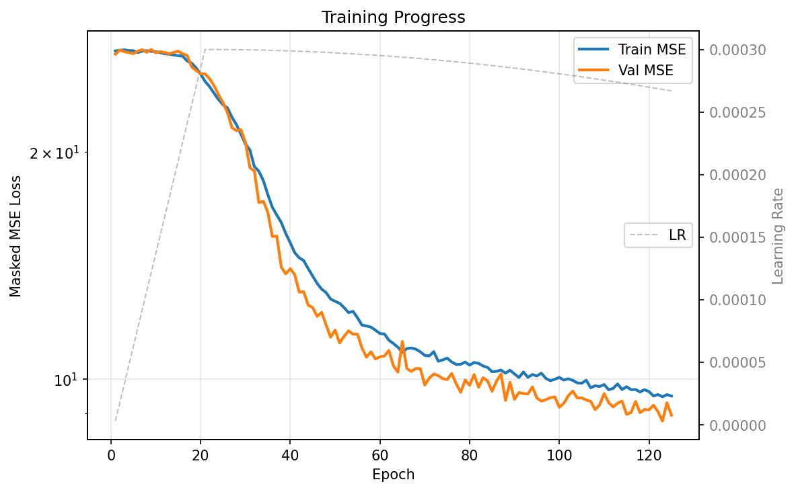
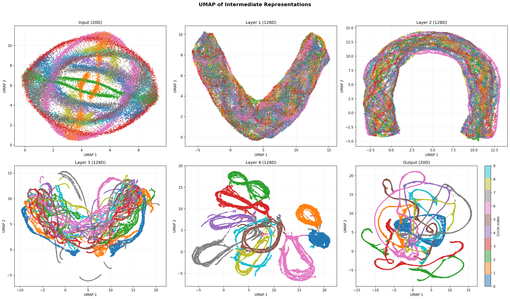

# Synthetic BERT

BERT-style masked prediction on synthetic syllable time series — circles in high-dimensional space with Markov switching dynamics.

## Dataset Generation

The dataset is a synthetic time series that mimics syllable-structured sequential data (like birdsong). A point traverses one of 10 circles embedded in 20-dimensional space, switching between circles according to a sparse Markov transition matrix.

**Key properties:**

- **10 circles** in 20D ambient space, each in its own random 2D sub-plane, all sharing the same center (origin)
- **Fixed angular velocity per circle**, with periods from 40 steps (fastest) to 400 steps (slowest) — a 10x speed range
- **~400 step dwell time** per visit, achieved by varying the number of complete revolutions (quantised to whole laps so entry/exit angles are fixed)
- **Sparse off-diagonal transition matrix** with ring connectivity plus long-range shortcuts
- **Controllable geometric overlap** via `--subspace-dim` (see below)
- **SNR ≈ 2.5** — isotropic Gaussian noise added to every observation

```bash
python markov_circles_timeseries.py                    # generate with UMAP
python markov_circles_timeseries.py --no-umap          # skip UMAP (faster)
python markov_circles_timeseries.py --subspace-dim 4   # with geometric overlap
```

### Subspace overlap control

The `--subspace-dim` flag forces all circle planes into a shared subspace, controlling how much trajectories overlap:

| `--subspace-dim` | Behaviour |
|---|---|
| **20** (default) | Planes span full 20D — **minimal overlap** |
| **4–6** | Planes share directions — **significant overlap** |
| **2** | All circles coplanar — **maximum overlap** |

### Sample data windows

Raw 20-dimensional time series with state labels. Each row is one ambient dimension; the coloured strip at top shows which circle is active.


### UMAP of raw data at different subspace dimensions

#### subspace_dim = 20 (no overlap)


With the full 20D ambient space, UMAP cleanly separates all 10 circles into distinct clusters. Levina-Bickel dimension in UMAP space drops to ~1.3 at k=100 — the estimator sees isolated 1D curves.

#### subspace_dim = 4 (significant overlap)


With 10 circle planes crammed into a 4D subspace, UMAP can no longer fully separate them — clusters merge and trajectories intermingle. Levina-Bickel stays near ~1.9 at k=100 because the overlapping circles fill the 2D UMAP plane more uniformly.

| Metric | subspace_dim=20 | subspace_dim=4 |
|---|---|---|
| LB dim (k=10) | 2.25 | 2.27 |
| LB dim (k=30) | 1.79 | 2.07 |
| LB dim (k=100) | 1.31 | 1.94 |

## BERT Masked Prediction Model

A transformer encoder is trained to predict masked patches of the time series from surrounding context. This is a continuous analogue of BERT — instead of masking discrete tokens, we mask contiguous 16-step patches of the 20D signal and train the model to reconstruct them.

### Architecture

```
Input (batch, 512, 20)
  → replace masked positions with learnable [MASK] embedding
  → Linear(20 → 128)
  → sinusoidal positional encoding
  → 4 × TransformerEncoderLayer (4 heads, 512-dim FFN, GELU)
  → Linear(128 → 512 → 20)
  → MSE loss on masked positions only
```

872K parameters. 15% of time steps masked per window in contiguous patches of 16.

### Training

```bash
python masked_model.py --epochs 500          # train
python masked_model.py --eval bert_model.pt  # evaluate & visualize
```

The model uses AdamW with linear warmup (20 epochs) followed by cosine decay, trained on sliding windows with stride 128.



The training loss drops from ~27 (baseline: predicting zero) to ~8.8, which is close to the **noise floor of ~8.0** (noise_std² = 2.83² ≈ 8). This means the model has learned to reconstruct the noiseless circular signal nearly perfectly — the remaining error is irreducible observation noise.

### Masked predictions

The model fills in masked patches (grey regions in the state strip) using only the surrounding unmasked context:


Each figure shows four rows: (1) state labels with masked regions in grey, (2) ground truth heatmap, (3) model prediction, (4) prediction error on masked positions only. The model accurately reconstructs the oscillatory structure through the masked regions.

## Learned Representations

After training, we extract the intermediate representations from each transformer layer by running the full dataset through the model without masking. UMAP reveals how the model organises the data internally.

```bash
python evaluate_representations.py --checkpoint bert_model.pt
python evaluate_representations.py --checkpoint bert_model.pt --layers 7          # single layer
python evaluate_representations.py --checkpoint bert_model.pt --layers input,4,output  # specific layers
```



**Input (20D):** The raw data — circles overlap due to subspace_dim=4 and noise.

**Layer 1–2:** The early transformer layers begin to separate circles and denoise the signal.

**Layer 3–4:** The deeper layers learn increasingly structured representations. The model discovers a lower-dimensional organisation of the 10 circles, clustering points by their circle identity and phase — exactly the information needed to predict masked patches.

**Output (20D):** The final output projection head maps the 128D internal representation back to the original 20D feature space. This is the denoised reconstruction — the same signal used to compute MSE loss against the ground truth during training. Comparing this panel to the Input panel shows the model has learned to clean up noise and sharpen circle structure.

The progression from Input → Layer 4 → Output shows the transformer learning to untangle the overlapping circles into a cleaner geometric structure, then projecting back to the original space, despite never being given explicit circle labels during training.

### 7-Layer model with extended context (1024-step windows)

A larger model (7 transformer layers, 1.47M parameters) trained on 200,000 time steps with 1024-step windows, stochastic mask patches (8–128 steps), stride 64, and BF16 mixed precision on an RTX 5090.

**Data:** 200k steps, 10 circles in full 20D ambient space (subspace_dim=20, no geometric overlap), noise_std=2.83 (SNR ≈ 2.5).

**Training:** 500 epochs, batch size 128, AdamW with linear warmup + cosine decay. Best val MSE: **8.06** (noise floor ≈ 8.0).

```bash
python masked_model_gpu.py --epochs 500 --n-layers 7 --stride 64 \
    --mask-patch-min 8 --mask-patch-max 128 --seq-len 1024 --no-train-eval
```


The Levina-Bickel intrinsic dimension shows a progressive compression through the network:

| Layer | k=10 | k=30 | k=100 |
|---|---|---|---|
| Input (20D) | 11.7 | 8.0 | 6.7 |
| Layer 1 | 14.8 | 12.4 | 10.6 |
| Layer 2 | 10.3 | 10.7 | 10.5 |
| Layer 3 | 9.6 | 9.6 | 7.7 |
| Layer 4 | 8.4 | 8.7 | 6.9 |
| Layer 5 | 6.3 | 7.2 | 7.9 |
| Layer 6 | 5.5 | 4.4 | 3.9 |
| Layer 7 | 5.4 | 2.6 | 1.6 |
| Output (20D) | 1.5 | 1.2 | 1.6 |

**Layer 1** initially *expands* dimensionality (projecting into 128D to separate circles), then **Layers 2–5** gradually compress, **Layers 6–7** make the major squeeze to ~2–3D, and the **Output** projection collapses to an intrinsic dimension of ~1.2 — close to the true 1D structure of each circle. The extended 1024-step context window gives the model enough information to nearly resolve the underlying circular manifold.

### 7-Layer model with overlapping circles (subspace_dim=4)

The same model architecture and training configuration as above, but with the 10 circle planes constrained to a **4-dimensional subspace** of the 20D ambient space. This forces significant geometric overlap between trajectories — circles can no longer be separated by the plane they occupy, so the model must rely on temporal dynamics (angular velocity, Markov transitions) to distinguish them.

**Data:** 200k steps, 10 circles in a **4D subspace** of 20D ambient space (subspace_dim=4), noise_std=2.83 (SNR ≈ 2.5).

**Training:** 7 transformer layers, 1.47M parameters, 1024-step windows, stochastic mask patches (8–128 steps), stride 64, BF16 mixed precision. Best val MSE: **8.10** (noise floor ≈ 8.0).

```bash
python markov_circles_timeseries.py --no-umap --n-steps 200000 --subspace-dim 4
python masked_model_gpu.py --epochs 500 --n-layers 7 --stride 64 \
    --mask-patch-min 8 --mask-patch-max 128 --seq-len 1024 --no-train-eval
```


| Layer | k=10 | k=30 | k=100 |
|---|---|---|---|
| Input (20D) | 14.1 | 11.4 | 8.9 |
| Layer 1 | 12.4 | 12.3 | 12.5 |
| Layer 2 | 8.2 | 6.7 | 6.7 |
| Layer 3 | 7.2 | 6.0 | 5.5 |
| Layer 4 | 7.5 | 7.0 | 5.1 |
| Layer 5 | 6.8 | 7.4 | 6.7 |
| Layer 6 | 5.0 | 4.8 | 5.2 |
| Layer 7 | 5.4 | 2.8 | 2.5 |
| Output (20D) | 1.6 | 1.6 | 2.1 |

Despite the heavy geometric overlap, the model reaches nearly the same val MSE (8.10 vs 8.06 for non-overlapping data). The key differences in the learned representations:

- **Layers 2–3** compress more aggressively (LB k=30: 6–7 vs 10–11) — the model quickly discovers the signal lives in a low-dimensional subspace.
- **Layer 7** and **Output** retain slightly higher dimensionality (2.8 and 1.6 vs 2.6 and 1.2 at k=30) — the model needs more structure to disambiguate overlapping circles than when they occupy orthogonal planes.
- The model successfully uses **temporal context** (angular velocity differences, transition patterns) to separate circles that are geometrically inseparable in any single time step.

## Scripts

| Script | Description |
|---|---|
| `markov_circles_timeseries.py` | Generate the synthetic time series dataset |
| `dataset.py` | PyTorch Dataset with sliding windows and patch masking |
| `masked_model.py` | BERT-style masked prediction model (train & eval) |
| `masked_model_gpu.py` | GPU-optimised version (BF16, torch.compile, RTX 5090) |
| `evaluate_representations.py` | Extract and visualise intermediate representations |
| `estimate_dimension.py` | Levina-Bickel intrinsic dimension estimation |
| `levina_bickel_demo.py` | Single-circle dimension estimation demo |

## Requirements

```
numpy
scipy
matplotlib
umap-learn
torch
```

```bash
python -m venv venv
source venv/bin/activate
pip install numpy scipy matplotlib umap-learn torch
```
