# Synthetic BERT

BERT-style masked prediction on synthetic syllable time series — circles in high-dimensional space with Markov switching dynamics.

## Dataset Generation

The dataset is a synthetic time series that mimics syllable-structured sequential data (like birdsong). A point traverses one of 10 circles embedded in 20-dimensional space, switching between circles according to a sparse Markov transition matrix.

**Key properties:**

- **10 circles** in 20D ambient space, each in its own random 2D sub-plane, all sharing the same center (origin)
- **Fixed angular velocity per circle**, with periods from 40 steps (fastest) to 400 steps (slowest) — a 10x speed range
- **~400 step dwell time** per visit, achieved by varying the number of complete revolutions (quantised to whole laps so entry/exit angles are fixed)
- **Sparse off-diagonal transition matrix** with ring connectivity plus long-range shortcuts
- **Controllable geometric overlap** via `--subspace-dim` (see below)
- **SNR ≈ 2.5** — isotropic Gaussian noise added to every observation

```bash
python markov_circles_timeseries.py                    # generate with UMAP
python markov_circles_timeseries.py --no-umap          # skip UMAP (faster)
python markov_circles_timeseries.py --subspace-dim 4   # with geometric overlap
```

### Subspace overlap control

The `--subspace-dim` flag forces all circle planes into a shared subspace, controlling how much trajectories overlap:

| `--subspace-dim` | Behaviour |
|---|---|
| **20** (default) | Planes span full 20D — **minimal overlap** |
| **4–6** | Planes share directions — **significant overlap** |
| **2** | All circles coplanar — **maximum overlap** |

### Sample data windows

Raw 20-dimensional time series with state labels. Each row is one ambient dimension; the coloured strip at top shows which circle is active.

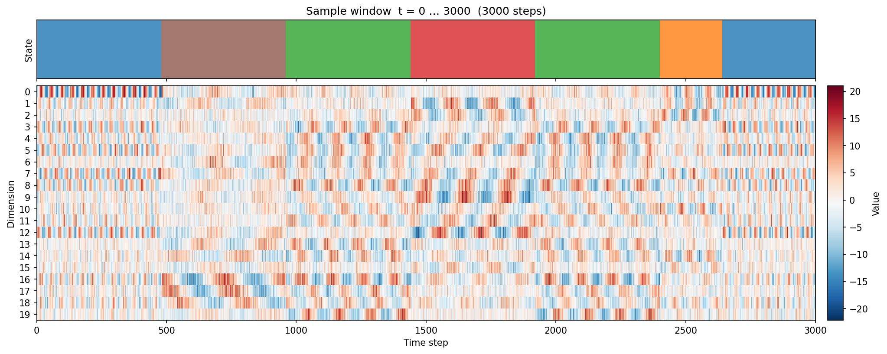

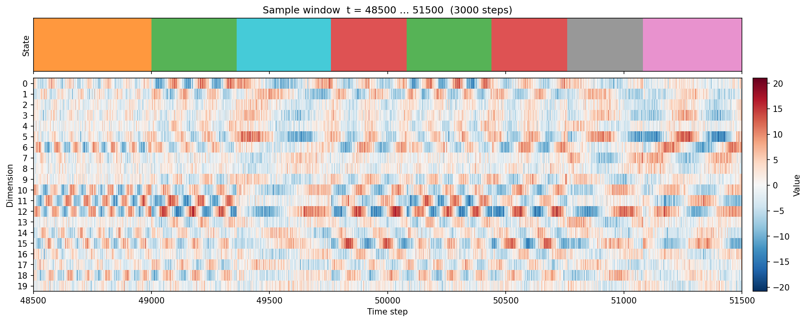

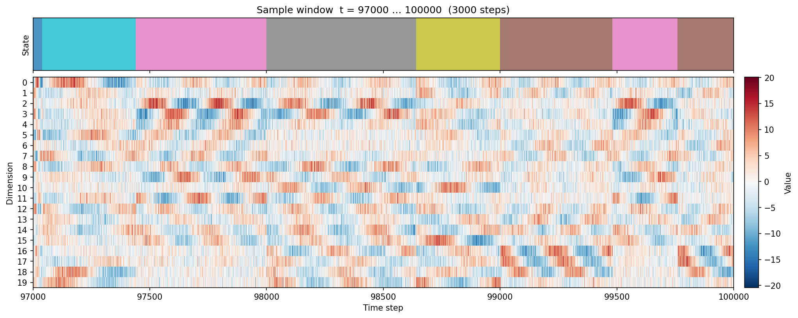

### UMAP of raw data at different subspace dimensions

#### subspace_dim = 20 (no overlap)

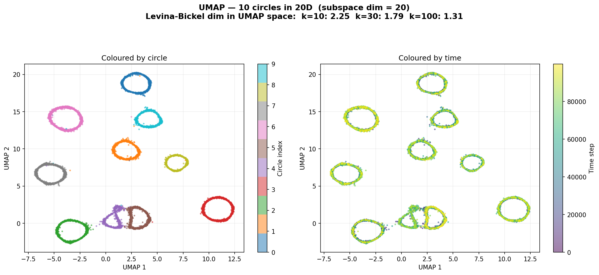

With the full 20D ambient space, UMAP cleanly separates all 10 circles into distinct clusters. Levina-Bickel dimension in UMAP space drops to ~1.3 at k=100 — the estimator sees isolated 1D curves.

#### subspace_dim = 4 (significant overlap)

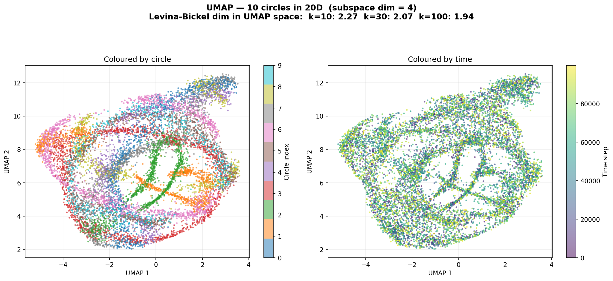

With 10 circle planes crammed into a 4D subspace, UMAP can no longer fully separate them — clusters merge and trajectories intermingle. Levina-Bickel stays near ~1.9 at k=100 because the overlapping circles fill the 2D UMAP plane more uniformly.

| Metric | subspace_dim=20 | subspace_dim=4 |
|---|---|---|
| LB dim (k=10) | 2.25 | 2.27 |
| LB dim (k=30) | 1.79 | 2.07 |
| LB dim (k=100) | 1.31 | 1.94 |

## BERT Masked Prediction Model

A transformer encoder is trained to predict masked patches of the time series from surrounding context. This is a continuous analogue of BERT — instead of masking discrete tokens, we mask contiguous patches of the 20D signal and train the model to reconstruct them.

### Architecture

```
Input (batch, seq_len, 20)
  → replace masked positions with learnable [MASK] embedding
  → Linear(20 → 128)
  → positional encoding (sinusoidal or T5 relative bias)
  → N × TransformerEncoderLayer (4 heads, 512-dim FFN, GELU)
  → Linear(128 → 512 → 20)
  → MSE loss on masked positions only
```

15% of time steps masked per window. Mask patch sizes can be fixed or stochastic (e.g. 8–128 steps).

Two positional encoding schemes are supported (selected via `--pos-encoding`):

| Scheme | Type | Description |
|---|---|---|
| `sinusoidal` (default) | Absolute, fixed | Standard Vaswani et al. (2017) sinusoidal encoding added to input embeddings |
| `t5` | Relative, learned | T5-style relative position bias (Raffel et al. 2020) — learned per-head additive bias on attention logits, indexed by bucketed relative distance |

The T5 relative bias uses logarithmic distance bucketing: nearby positions get individual buckets while distant positions share log-spaced buckets. This is injected as an additive mask into PyTorch's standard `nn.MultiheadAttention`, requiring no custom attention code. Bucket count and max distance are configurable via `--t5-num-buckets` and `--t5-max-distance`.

### Training

```bash
python masked_model.py --epochs 500                    # baseline (4 layers, 512 window)
python masked_model_gpu.py --epochs 500 --n-layers 7 \ # GPU-optimised, sinusoidal PE
    --seq-len 1024 --stride 64 --mask-patch-min 8 --mask-patch-max 128
python masked_model_gpu.py --epochs 500 --n-layers 7 \ # GPU-optimised, T5 relative bias
    --seq-len 1024 --stride 64 --mask-patch-min 8 --mask-patch-max 128 \
    --pos-encoding t5 --t5-num-buckets 64 --t5-max-distance 1024
```

The model uses AdamW with linear warmup (20 epochs) followed by cosine decay. The GPU-optimised version (`masked_model_gpu.py`) adds BF16 mixed precision, `torch.compile`, and multi-worker data loading.

### Masked predictions

The model fills in masked patches (grey regions in the state strip) using only the surrounding unmasked context:

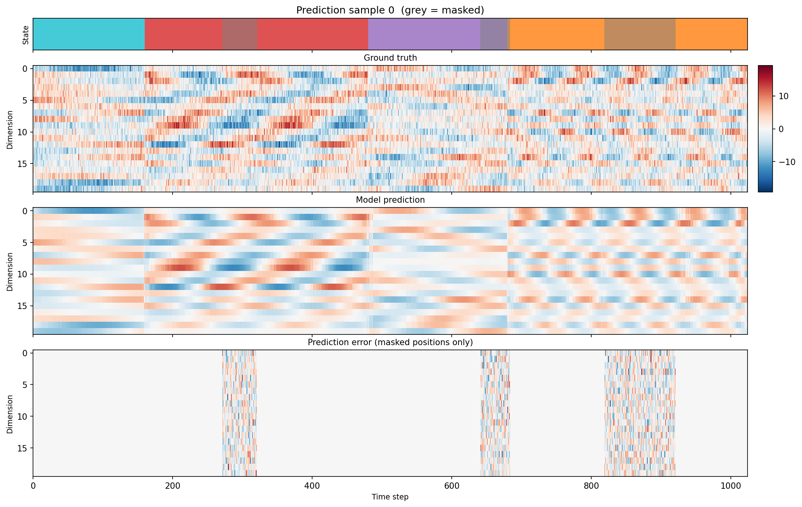

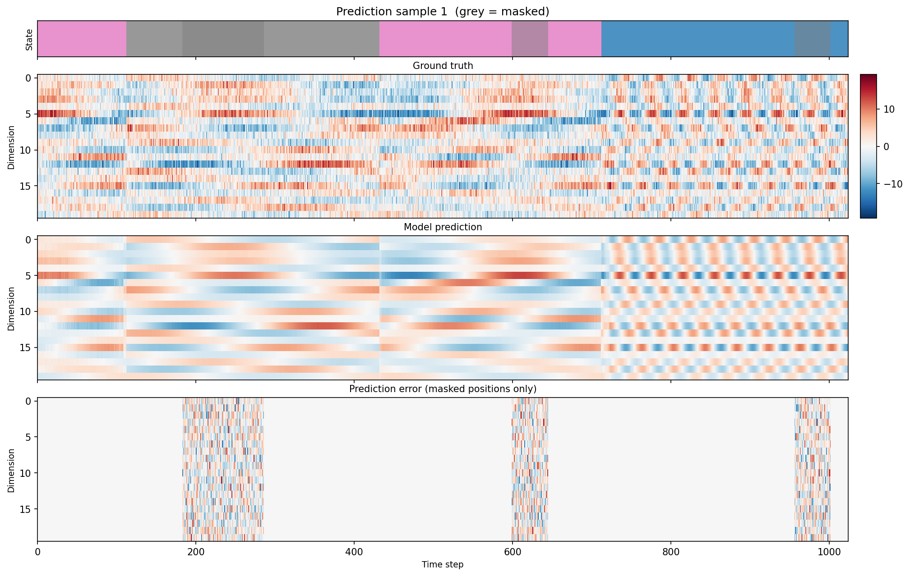

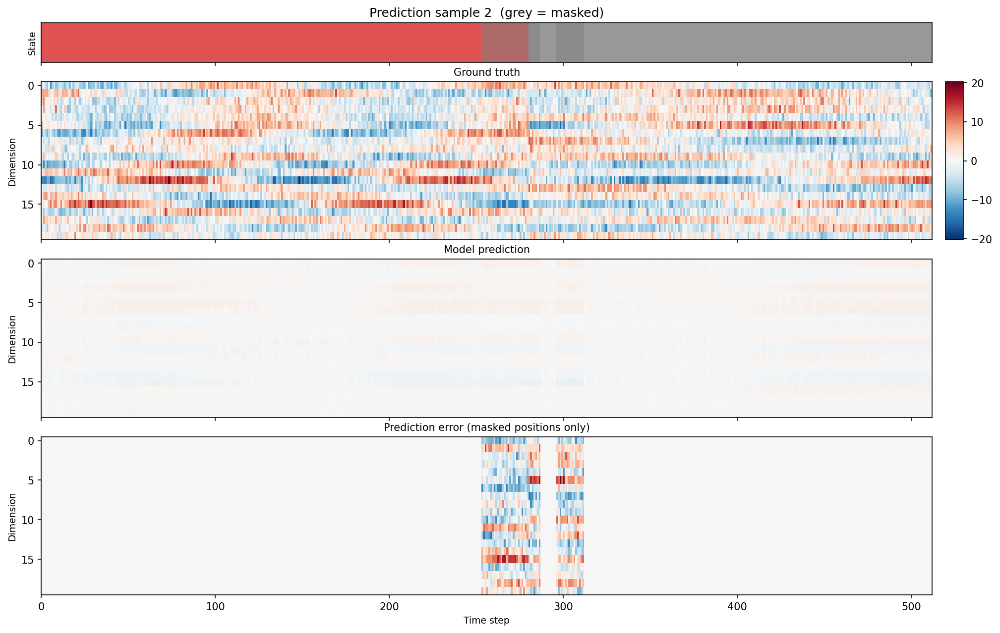

Each figure shows four rows: (1) state labels with masked regions in grey, (2) ground truth heatmap, (3) model prediction, (4) prediction error on masked positions only. The model accurately reconstructs the oscillatory structure through the masked regions.

## Learned Representations

After training, we extract the intermediate representations from each transformer layer by running the full dataset through the model without masking. UMAP reveals how the model organises the data internally, and Levina-Bickel intrinsic dimension estimates quantify the compression at each layer.

```bash
python evaluate_representations.py --checkpoint bert_model.pt                        # all layers
python evaluate_representations.py --checkpoint bert_model.pt --layers 7             # single layer
python evaluate_representations.py --checkpoint bert_model.pt --layers input,4,output # specific layers
```

### 7-Layer model with sinusoidal PE — no overlap (subspace_dim=20)

7 transformer layers (1.47M parameters) with **sinusoidal positional encoding**, trained on 200,000 time steps with 1024-step windows, stochastic mask patches (8–128 steps), stride 64, and BF16 mixed precision.

**Data:** 200k steps, 10 circles in full 20D ambient space (subspace_dim=20, no geometric overlap), noise_std=2.83 (SNR ≈ 2.5).

**Training:** 500 epochs, batch size 128, AdamW with linear warmup + cosine decay. Best val MSE: **8.06** (noise floor ≈ 8.0).

```bash
python masked_model_gpu.py --epochs 500 --n-layers 7 --stride 64 \
    --mask-patch-min 8 --mask-patch-max 128 --seq-len 1024 --no-train-eval
```


The Levina-Bickel intrinsic dimension shows a progressive compression through the network:

| Layer | k=10 | k=30 | k=100 |
|---|---|---|---|
| Input (20D) | 11.7 | 8.0 | 6.7 |
| Layer 1 | 14.8 | 12.4 | 10.6 |
| Layer 2 | 10.3 | 10.7 | 10.5 |
| Layer 3 | 9.6 | 9.6 | 7.7 |
| Layer 4 | 8.4 | 8.7 | 6.9 |
| Layer 5 | 6.3 | 7.2 | 7.9 |
| Layer 6 | 5.5 | 4.4 | 3.9 |
| Layer 7 | 5.4 | 2.6 | 1.6 |
| Output (20D) | 1.5 | 1.2 | 1.6 |

**Layer 1** initially *expands* dimensionality (projecting into 128D to separate circles), then **Layers 2–5** gradually compress, **Layers 6–7** make the major squeeze to ~2–3D, and the **Output** projection collapses to an intrinsic dimension of ~1.2 — close to the true 1D structure of each circle. The extended 1024-step context window gives the model enough information to nearly resolve the underlying circular manifold.

### 7-Layer model with sinusoidal PE — overlapping circles (subspace_dim=4)

The same model architecture and training configuration as above (sinusoidal positional encoding), but with the 10 circle planes constrained to a **4-dimensional subspace** of the 20D ambient space. This forces significant geometric overlap between trajectories — circles can no longer be separated by the plane they occupy, so the model must rely on temporal dynamics (angular velocity, Markov transitions) to distinguish them.

**Data:** 200k steps, 10 circles in a **4D subspace** of 20D ambient space (subspace_dim=4), noise_std=2.83 (SNR ≈ 2.5).

**Training:** 7 transformer layers, 1.47M parameters, 1024-step windows, stochastic mask patches (8–128 steps), stride 64, BF16 mixed precision. Best val MSE: **8.10** (noise floor ≈ 8.0).

```bash
python markov_circles_timeseries.py --no-umap --n-steps 200000 --subspace-dim 4
python masked_model_gpu.py --epochs 500 --n-layers 7 --stride 64 \
    --mask-patch-min 8 --mask-patch-max 128 --seq-len 1024 --no-train-eval
```

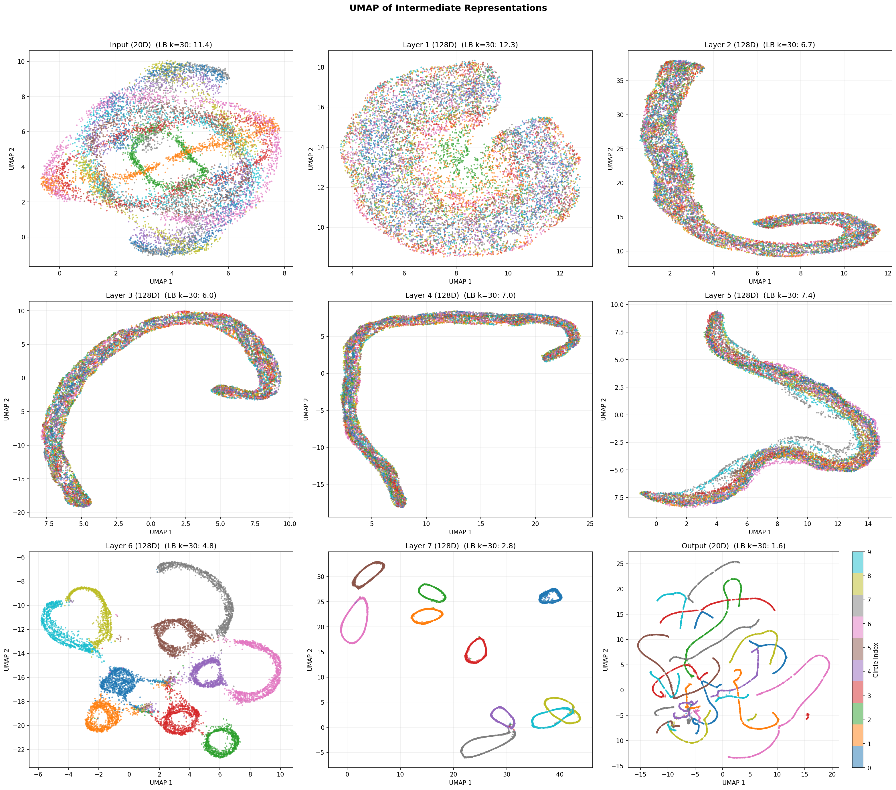

| Layer | k=10 | k=30 | k=100 |
|---|---|---|---|
| Input (20D) | 14.1 | 11.4 | 8.9 |
| Layer 1 | 12.4 | 12.3 | 12.5 |
| Layer 2 | 8.2 | 6.7 | 6.7 |
| Layer 3 | 7.2 | 6.0 | 5.5 |
| Layer 4 | 7.5 | 7.0 | 5.1 |
| Layer 5 | 6.8 | 7.4 | 6.7 |
| Layer 6 | 5.0 | 4.8 | 5.2 |
| Layer 7 | 5.4 | 2.8 | 2.5 |
| Output (20D) | 1.6 | 1.6 | 2.1 |

Despite the heavy geometric overlap, the model reaches nearly the same val MSE (8.10 vs 8.06 for non-overlapping data). The key differences in the learned representations:

- **Layers 2–3** compress more aggressively (LB k=30: 6–7 vs 10–11) — the model quickly discovers the signal lives in a low-dimensional subspace.
- **Layer 7** and **Output** retain slightly higher dimensionality (2.8 and 1.6 vs 2.6 and 1.2 at k=30) — the model needs more structure to disambiguate overlapping circles than when they occupy orthogonal planes.
- The model successfully uses **temporal context** (angular velocity differences, transition patterns) to separate circles that are geometrically inseparable in any single time step.

### 7-Layer model with T5 relative position bias (subspace_dim=20)

Same architecture and data as the first sinusoidal model above, but replacing the absolute sinusoidal positional encoding with **T5-style learned relative position bias** (64 buckets, max distance 1024). The relative bias is applied as an additive per-head mask on the attention logits — each head learns its own distance-dependent attention pattern.

**Data:** 200k steps, 10 circles in full 20D ambient space (subspace_dim=20, no geometric overlap), noise_std=2.83 (SNR ≈ 2.5).

**Training:** 7 transformer layers, 1.47M parameters, 1024-step windows, stochastic mask patches (8–128 steps), stride 64, BF16 mixed precision. Best val MSE: **8.03** (noise floor ≈ 8.0).

```bash
python masked_model_gpu.py --epochs 500 --n-layers 7 --stride 64 \
    --mask-patch-min 8 --mask-patch-max 128 --seq-len 1024 --no-train-eval \
    --pos-encoding t5 --t5-num-buckets 64 --t5-max-distance 1024
```

#### Training dynamics: T5 vs sinusoidal

The T5 model converges noticeably faster and more smoothly than the sinusoidal baseline.

| | Sinusoidal | T5 relative bias |
|---|---|---|
| **Training loss curve** |  | 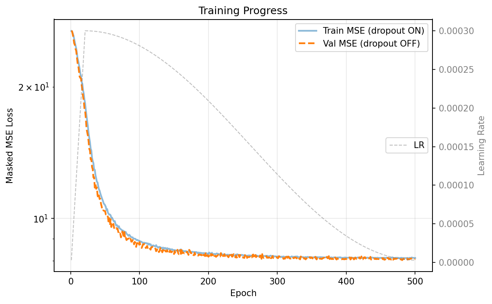 |

With sinusoidal positional encoding, the loss curve shows a **plateau around epochs 80–130** before a second phase of rapid descent — the model appears to pass through a more entangled intermediate state before finding a good representation. With T5 relative bias, the descent is **monotonic and smooth**, reaching the noise floor by ~epoch 100 without any visible plateau. This suggests that learned relative position biases provide a more direct inductive bias for this task: instead of needing to first disentangle absolute position information from the signal, the model can focus on relative temporal relationships from the start.

#### Learned representations (T5)

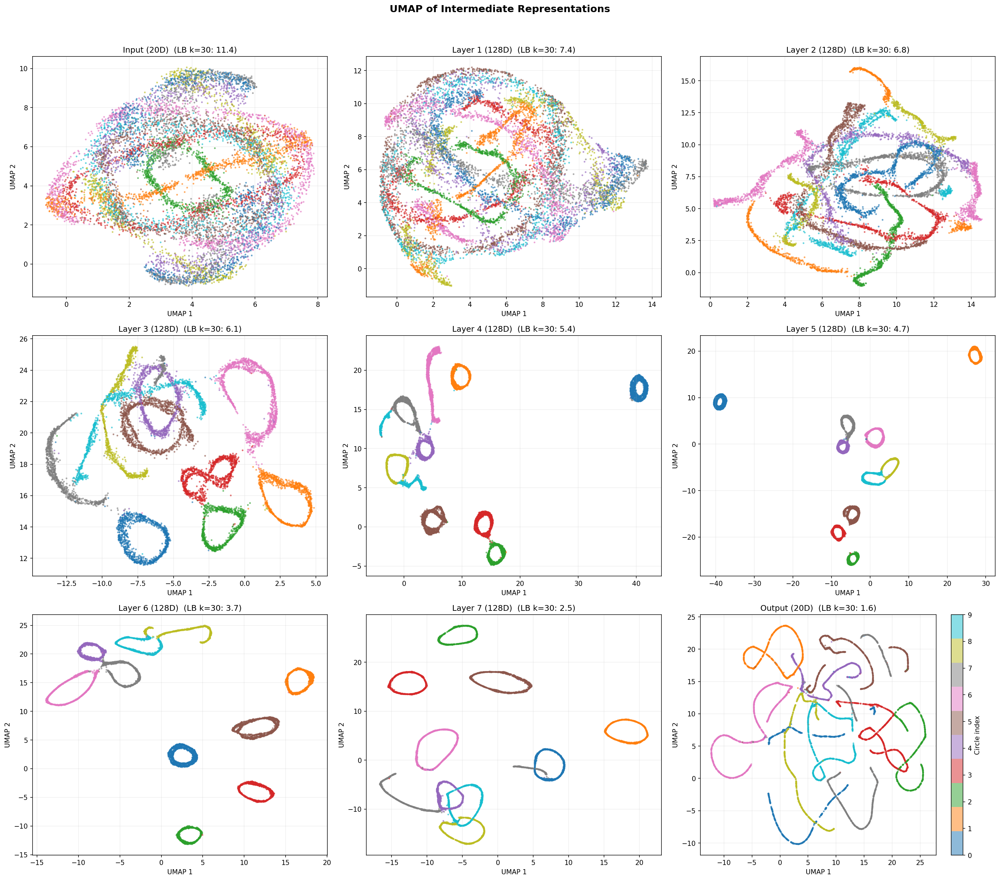

| Layer | k=10 | k=30 | k=100 |
|---|---|---|---|
| Input (20D) | 14.1 | 11.4 | 8.9 |
| Layer 1 | 10.5 | 7.4 | 5.3 |
| Layer 2 | 8.7 | 6.8 | 5.8 |
| Layer 3 | 7.7 | 6.1 | 6.0 |
| Layer 4 | 7.1 | 5.4 | 5.5 |
| Layer 5 | 6.7 | 4.7 | 4.4 |
| Layer 6 | 6.1 | 3.7 | 3.3 |
| Layer 7 | 5.2 | 2.5 | 2.8 |
| Output (20D) | 1.7 | 1.6 | 2.1 |

Compared to the sinusoidal model, the T5 representations show **smooth, monotonic dimension reduction from Layer 1 onward** — there is no initial dimensionality expansion at Layer 1 (LB k=30: 7.4 for T5 vs 12.4 for sinusoidal). The model passes through a less entangled state in the early layers, consistent with the smoother training dynamics. By the final layers, both models converge to similar intrinsic dimensions (~2.5 at k=30), confirming that the T5 model finds an equally compact representation of the circular manifolds while taking a more direct path to get there.

### 7-Layer model with RoPE (subspace_dim=20)

Same architecture and data, but using **Rotary Position Embedding** (RoPE, Su et al. 2021). RoPE encodes relative position by rotating query and key vectors in attention — pairs of dimensions are rotated by angles proportional to position, so the dot product between Q and K naturally depends on their relative distance. This requires a custom transformer encoder layer with RoPE baked into the attention computation, using `scaled_dot_product_attention` for flash-attention compatibility.

**Data:** 200k steps, 10 circles in full 20D ambient space (subspace_dim=20, no geometric overlap), noise_std=2.83 (SNR ≈ 2.5).

**Training:** 7 transformer layers, 1.47M parameters, 1024-step windows, stochastic mask patches (8–128 steps), stride 64, BF16 mixed precision. Best val MSE: **7.996** (noise floor ≈ 8.0).

```bash
python masked_model_gpu.py --epochs 500 --n-layers 7 --stride 64 \
    --mask-patch-min 8 --mask-patch-max 128 --seq-len 1024 --no-train-eval \
    --pos-encoding rope
```

#### Training dynamics: RoPE converges fastest

RoPE converges significantly faster than both sinusoidal and T5 positional encoding.

| Sinusoidal | T5 relative bias | RoPE |
|---|---|---|
|  |  | 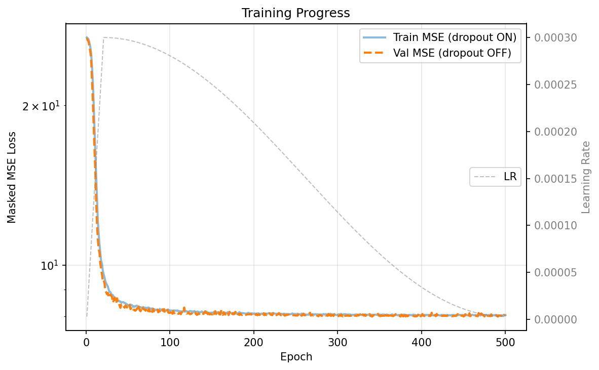 |

RoPE reaches the noise floor by approximately **epoch 50** — roughly twice as fast as T5 (~100 epochs) and far faster than sinusoidal (~200 epochs with a plateau). The loss curve is the smoothest of all three schemes, with no plateaus or step transitions. This is consistent with RoPE's inductive bias: by encoding relative position directly into the geometry of the attention computation (via rotations in Q/K space), the model can immediately attend based on relative distance without needing to learn this capability from scratch.

| Metric | Sinusoidal | T5 | RoPE |
|---|---|---|---|
| Best val MSE | 8.06 | 8.03 | **7.996** |
| Approx. epochs to noise floor | ~200 | ~100 | **~50** |
| Plateau in training? | Yes (epochs 80–130) | No | No |

#### Learned representations (RoPE)

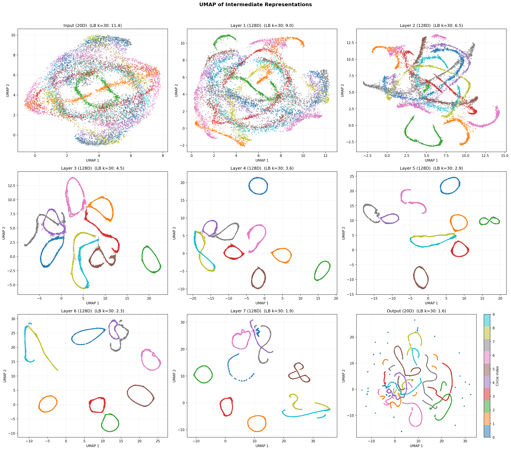

| Layer | k=10 | k=30 | k=100 |
|---|---|---|---|
| Input (20D) | 14.1 | 11.4 | 8.9 |
| Layer 1 | 12.5 | 9.0 | 6.4 |
| Layer 2 | 9.4 | 6.5 | 5.1 |
| Layer 3 | 7.2 | 4.5 | 4.2 |
| Layer 4 | 6.5 | 3.6 | 3.3 |
| Layer 5 | 5.7 | 2.9 | 2.6 |
| Layer 6 | 4.6 | 2.3 | 2.2 |
| Layer 7 | 3.8 | 1.9 | 2.4 |
| Output (20D) | 1.5 | 1.6 | 2.1 |

RoPE produces the **most aggressive and monotonic dimension compression** of all three schemes. Key comparisons at k=30:

- **Layer 1**: 9.0 (RoPE) vs 12.4 (sinusoidal) vs 7.4 (T5) — no dimensionality expansion
- **Layer 4**: 3.6 (RoPE) vs 8.7 (sinusoidal) vs 5.4 (T5) — circles already well-separated
- **Layer 7**: 1.9 (RoPE) vs 2.6 (sinusoidal) vs 2.5 (T5) — tightest final compression

The circles separate cleanly by Layers 3–4 (2–3 layers earlier than sinusoidal), and the final intrinsic dimension of 1.9 is the closest to the true 1D structure of each circular manifold. RoPE's rotational encoding appears to be a natural match for this data — the underlying signal is literally circular motion, and RoPE's position-dependent rotations in embedding space may provide a particularly efficient basis for representing periodic temporal structure.

## Scripts

| Script | Description |
|---|---|
| `markov_circles_timeseries.py` | Generate the synthetic time series dataset |
| `dataset.py` | PyTorch Dataset with sliding windows and patch masking |
| `masked_model.py` | BERT-style masked prediction model (train & eval) |
| `masked_model_gpu.py` | GPU-optimised version (BF16, torch.compile, RTX 5090) |
| `evaluate_representations.py` | Extract and visualise intermediate representations |
| `estimate_dimension.py` | Levina-Bickel intrinsic dimension estimation |
| `levina_bickel_demo.py` | Single-circle dimension estimation demo |

## Requirements

```
numpy
scipy
matplotlib
umap-learn
torch
```

```bash
python -m venv venv
source venv/bin/activate
pip install numpy scipy matplotlib umap-learn torch
```
