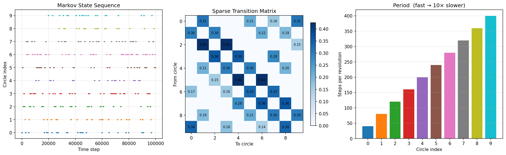
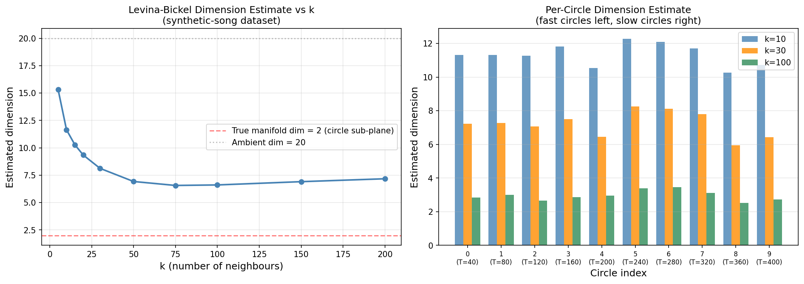

# Synthetic Song

Synthetic syllable-based time series on circles in high-dimensional space, with Markov switching dynamics and Levina-Bickel intrinsic dimension estimation.

## Overview

This project generates a time series that mimics syllable-structured sequential data (like birdsong). A point traverses one of 10 circles embedded in 20-dimensional space, switching between circles according to a sparse Markov transition matrix. Each circle has a fixed angular velocity, producing distinct oscillation frequencies that serve as a signature for each "syllable."

### Key properties

- **10 circles** in 20D ambient space, each in its own random 2D sub-plane, all sharing the same center (origin)
- **Statistically similar radii** (~20), large enough that the circular signal spans all dimensions
- **Fixed angular velocity per circle**, with periods ranging from 40 steps (fastest) to 400 steps (slowest) — a 10x speed range
- **~400 step dwell time** per visit, achieved by varying the number of complete revolutions (quantised to whole laps so entry/exit angles are fixed)
- **Sparse off-diagonal transition matrix** with ring connectivity plus long-range shortcuts
- **Controllable geometric overlap** via the `--subspace-dim` flag (see below)

## Scripts

### `markov_circles_timeseries.py`

Generates the Markov-switching circle time series with optional UMAP visualisation.

```bash
python markov_circles_timeseries.py                    # full run with UMAP
python markov_circles_timeseries.py --no-umap          # skip UMAP (much faster)
python markov_circles_timeseries.py --subspace-dim 4   # with geometric overlap
```

#### Subspace dimensionality (`--subspace-dim`)

By default each circle's 2D plane is drawn independently from the full 20D ambient space. In high dimensions, random planes are nearly orthogonal, so the 10 circles occupy essentially non-overlapping subspaces and their noisy trajectories never cross.

The `--subspace-dim` flag forces all circle planes into a shared subspace of the given dimension. Because there are only `subspace_dim` directions available, the 2D planes must share basis directions and the circles overlap geometrically. Combined with observation noise, this produces actual trajectory crossings in the ambient space.

| `--subspace-dim` | Behaviour |
|---|---|
| **20** (or omitted) | Each circle's plane is drawn from the full 20D space. Planes are nearly orthogonal — **minimal overlap**. This is the default. |
| **4–6** | All 10 circle planes are drawn from a 4–6D subspace. Planes share many directions — **significant overlap**. UMAP shows partially merged clusters with trajectories crossing between circles. |
| **3** | 10 circles in 3D. Most plane pairs intersect along a line — **heavy overlap**. |
| **2** | All circles are **coplanar** (same 2D plane). They become concentric rings separated only by their slightly different radii and noise. **Maximum overlap**. |

This parameter is recorded in `data/config.json` for reproducibility. It also has a direct connection to intrinsic dimension estimation: the global Levina-Bickel dimension at intermediate k should approximate the `subspace_dim` value, since that is the true dimension of the subspace the circles collectively span.

### `dataset.py`

PyTorch `Dataset` for the synthetic-song time series. Loads `data/data.npz` and serves fixed-length sliding windows with patch-based masking, ready for a BERT-style masked prediction model.

```python
from dataset import SyntheticSongDataset

ds = SyntheticSongDataset('data', seq_len=512)
x, state, mask = ds[0]
```

### `estimate_dimension.py`

Runs the Levina-Bickel MLE dimension estimator on the saved synthetic-song dataset at various k values, both globally and per-circle.

```bash
python estimate_dimension.py
```

### `levina_bickel_demo.py`

Demonstrates the Levina-Bickel MLE intrinsic dimension estimator on a single noisy circle, showing how the estimate depends on the neighbourhood scale `k` and noise level.

```bash
python levina_bickel_demo.py
```

## Results

### Markov-switching time series summary



**Top row:** Markov state sequence over time, sparse transition matrix, and per-circle period (steps per revolution).
**Bottom row:** UMAP embedding coloured by circle index and by time step.

Note: this composite figure is regenerated each run and reflects whichever `--subspace-dim` was last used. See the [UMAP comparison section](#umap-embeddings-at-different-subspace-dimensions) for side-by-side images at specific subspace dimensions.

### Sample data windows

Raw 20-dimensional time series with state labels. Each column is one time step; each row is one ambient dimension. The coloured strip at top shows which circle is active.


### Dimension estimation on the synthetic-song dataset



Levina-Bickel MLE intrinsic dimension estimates computed on 2000 subsampled points from the synthetic-song dataset (SNR ≈ 2.5, **subspace_dim = 20**, i.e. default / no overlap).

There are two ways to measure the dimension of this dataset: **globally** (all points pooled together) and **per-circle** (only points from one circle at a time). These give very different answers, and the difference is informative.

**Left — Global dimension vs k (all circles pooled):**

| k | Estimated dimension |
|---|---|
| 5 | 15.3 |
| 10 | 11.7 |
| 20 | 9.3 |
| 50 | 6.9 |
| 100 | 6.6 |
| 200 | 7.2 |

When all 10 circles are pooled, the estimator sees a **mixture of 10 different 2D sub-planes** in 20D space, plus noise. This is not a single 2-dimensional manifold — it is a union of manifolds that collectively span a higher-dimensional subspace. The global estimate bottoms out around ~6.6, reflecting this multi-manifold structure:

- **Small k (5–20):** Neighbourhoods are dominated by noise, which is isotropic in all 20 dimensions. The estimate inflates toward the ambient dimension (20).
- **Intermediate k (50–100):** Neighbourhoods are large enough to average out noise but still mostly sample from a single circle. The estimate reaches a minimum (~6.6), which exceeds 2 because some neighbourhoods straddle transitions between circles that lie in different 2D sub-planes.
- **Large k (150–200):** Neighbourhoods span points from multiple circles in different sub-planes. The union of several 2D sub-planes spans an increasingly high-dimensional subspace, pushing the estimate back up.

**Right — Per-circle dimension at selected k values:**

| Circle | Period | k=10 | k=30 | k=100 |
|--------|--------|------|------|-------|
| 0 | 40 | 11.3 | 7.2 | 2.8 |
| 1 | 80 | 11.3 | 7.3 | 3.0 |
| 5 | 240 | 12.3 | 8.3 | 3.4 |
| 9 | 400 | 10.7 | 6.4 | 2.7 |

When we restrict to points from a **single circle**, the estimator sees exactly one 2D sub-plane plus noise. At k=100, all circles converge to ~2.5–3.5, close to the true manifold dimension of 2. The residual above 2 comes from observation noise inflating the local dimension estimate.

**Why the global and per-circle estimates differ:** The global estimate is higher because the Levina-Bickel estimator assumes data lies on a single smooth manifold. When the data is actually a *mixture* of manifolds in different sub-planes, neighbourhoods that mix points from different circles see a higher effective dimension — the dimension of the union, not any individual component. Restricting to one circle at a time eliminates this mixing and recovers the true per-manifold dimension.

### UMAP embeddings at different subspace dimensions

The standalone UMAP plots below show how the `--subspace-dim` parameter affects the geometric structure of the data, along with Levina-Bickel dimension estimates computed directly in the 2D UMAP space.

#### subspace_dim = 20 (no overlap — default)


With the full 20D ambient space available, each circle's 2D plane is nearly orthogonal to every other. UMAP cleanly separates all 10 circles into distinct, well-isolated clusters. The Levina-Bickel dimension in UMAP space drops from ~2.25 (k=10) to ~1.31 (k=100): at large neighbourhood scales the estimator sees essentially 1D curves (circles mapped to loops), with no inter-circle contamination.

#### subspace_dim = 4 (significant overlap)


When all 10 circle planes are drawn from a shared 4D subspace, planes must share basis directions and the circles overlap geometrically in the ambient space. UMAP can no longer fully separate them — clusters merge and trajectories from different circles intermingle. The Levina-Bickel dimension in UMAP space stays higher: ~2.27 (k=10) to ~1.94 (k=100). The estimate remains close to 2 even at large k because the overlapping circles fill the 2D UMAP plane more uniformly, making the embedding look like a surface rather than a collection of isolated curves.

#### Comparison

| Metric | subspace_dim=20 | subspace_dim=4 |
|---|---|---|
| LB dim (k=10) | 2.25 | 2.27 |
| LB dim (k=30) | 1.79 | 2.07 |
| LB dim (k=100) | 1.31 | 1.94 |
| UMAP separation | Clean, isolated clusters | Merged, overlapping clusters |

The key takeaway: reducing the subspace dimension increases geometric overlap between circles, which UMAP reflects as merged clusters and the Levina-Bickel estimator reflects as higher effective dimension in the embedding space. At k=100, the jump from 1.31 to 1.94 directly measures how much the overlap fills the UMAP plane.

### Levina-Bickel demo (single noisy circle)


Estimated intrinsic dimension vs neighbourhood size `k` for a single circle in 10D with varying noise levels. Without noise the estimator correctly finds dimension ~1. With noise, small `k` overestimates (noise dominates) and large `k` recovers the manifold.

## Requirements

```
numpy
scipy
matplotlib
umap-learn
torch        # optional, only needed for dataset.py
```

Install into a virtual environment:

```bash
python -m venv venv
source venv/bin/activate
pip install numpy scipy matplotlib umap-learn
pip install torch  # optional, for the PyTorch data loader
```
